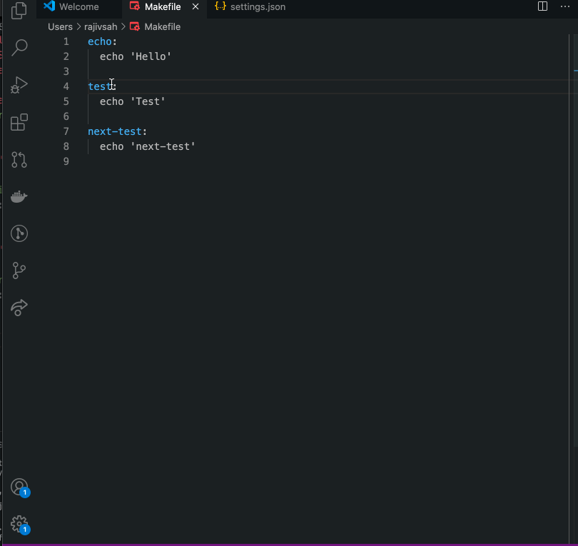

## Makefile Runner
Allows us to run/copy make targets directly from vscode terminal.
### Setup Options(Optional)
To export environment variables while running targets.
Open `settings.json` and add configs
``` json
"make-runner.env": {
  "development": {
    "AWS_PROFILE": "development",
    "RAILS_ENV": "development",
    "ROLE": "admin",
    "ENABLE_MFA": false
  },
  "staging": {
    "AWS_PROFILE": "staging",
    "RAILS_ENV": "staging",
    "ROLE": "user",
    "ENABLE_MFA": true
  },
  "none": {}
}
```
<b>Note</b>: This is optional step to export environment variables while running the targets.

### Usage
- Open any Makefile
- Put the cursor on any target
#### 1. Run the target in the vscode terminal
- Use key bindings `cmd+shift+enter` for Mac or `ctrl+shift+enter` for PC to run the target.

<b>Note</b>: This will execute the commands in the active terminal of vscode. If your current terminal is busy, create a new terminal before executing the target.

#### 2. Copy the command
- Use key bindings `cmd+shift+c` for Mac or `ctrl+shift+c` for PC to copy the target command. Now you can paste the command in the terminal of your choice.

